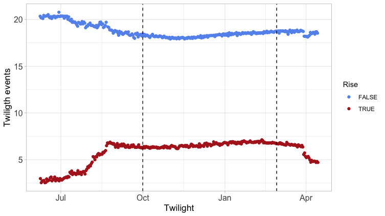
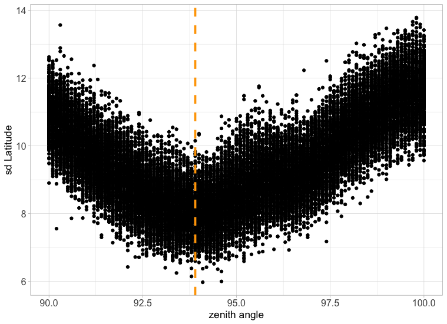
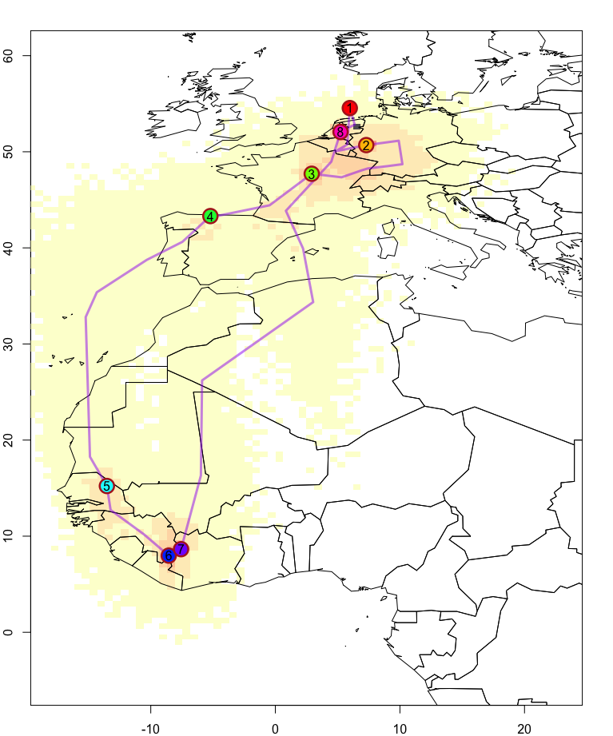

# Geolocation by Light: movement analysis and calibration methods in SGAT

Geolocation by light refers to a tracking method for animals and notably birds using archival tags that record light intensities over time. From light, twilight events or periods (sunrise, sunset) can be identified. Using a reference zenith angle defining the suns position during the defined sunrise/sunset time, locations can be calculated. Given that light is subject to multiple sources of shading (e.g., clouds, vegetation), the method results in low accuracy compared to e.g., gps locations. Multiple methods have been developed to derive robust location estimates and quantify the location specific error (see Lisovski et al. 2012, 2020). 

**Calibration** is a crucial part of geolocation by light. Getting the correct zenith angle for the defined twilight events events is usually done using recordings with known location (e.g., after deployment on the breeding site of the individual). However, often the conditions (weather, habitat) on the breeding sites do not match the conditions during the migration and wintering period. This can lead to a bias in location estimates and even lower accuracy than on would expect given the twilight error distribution.

**_For a specific study on the migrations of Pied Flycatchers (Bell et al. in prep)_**, we developed a method that finds optimal zenith angles from  the major stationary period in Africa at unknown location, based on the principles of the so called [Hill-Ekstrom calibration](https://geolocationmanual.vogelwarte.ch/GeoLight.html#hill-ekstrom-calibration) (Lisovski et al. 2020).

After finding the best zenith angle, we can also conducted a **movement analysis**, a prior definition of periods when the bird was stationary. Here, we used a method previously described (e.g., Sander et al. 2021, Meier et al. 2022) and published in a github repository [invMovement](https://github.com/slisovski/invMovement). In a nutshell, the method investigates changes in sunrise and sunset and identifies changes that are larger than the expected error due to shading (based on estimates during periods at known location). Such changes are labeled as movement periods, while no change in sunrise/sunset over consecutive days, or small changes that are within the error distribution are labelled as stationary period.

For the analysis, we used the `groupThresholdModel` from the R package `SGAT` [GitHub repo](https://github.com/SWotherspoon/SGAT). This method allows to make use of movement analysis and estimates one single location for each defined stationary period, generally increasing accuracy (see description [here](https://geolocationmanual.vogelwarte.ch/SGAT.html#the-groupe-model)). However, often users struggle with the combination of the `invMovement` method in combination with the `groupThresholdMethod`. Often the MCMC simulation in SGAT fails using the labeled movement/stationary periods and the zenith angle from the calibration. This is a result of either incorrect zenith angles or more likely a movements happened during one or more defined stationary period and the zenith angle cannot infer single locations recorded at distant sites. To overcome this problem, we make use of the failing MCMC simulations to validate the stationary periods and optimize the best movement probability thresholds used in the `invMovement` method.

## The analysis pipeline

```
## required packages
# remotes::install_github("swotherspoon/SGAT")
library(SGAT)
# remotes::install_github("slisovski/invMovement")
library(invMovement)
library(TwGeos)
library(tidyverse)
library(MASS)
library(zoo)
library(raster)

## required functions
source("functions/SGAT_calibration_movement.R")
```

Here, we show the methods using an example from the Pied flycatcher study (Bell et al. in prep). Twiligth events where previously defined with the `preprocessLight` function from the R Package 'TwGeos' ([see](https://geolocationmanual.vogelwarte.ch/twilight.html)).

```
## import twilight data and define tag specific parameters

twl <- read.csv("example/piedFlycatcher_example.csv") %>%
  mutate(Twilight = as.POSIXct(Twilight, tz = "GMT")) %>%
  filter(!Deleted) %>% twilightAdjust(., 5*60)          

## Deplyment site (breeding site)
lon.calib <- 6.37  
lat.calib <- 52.83 
```

### Hill-Ekstrom calibration

Based in the defined sunrise and sunset times (and prior knowledge on the species behavior during their stay in Africa), it is evident that individuals remain stationary for a longer period south of the Sahara dessert.

```
ggplot(twl, aes(x = Twilight, y = hourOffset(as.hour(Twilight)), color = Rise)) +
  geom_point() +
  scale_color_manual(values = c("cornflowerblue", "firebrick")) +
  geom_vline(xintercept = as.POSIXct(c("2019-10-01", "2020-02-28")), linetype = 2) +
  theme_light() +
  ylab("Twiligth events") +
  theme(axis.text = element_text(size = 12),
        axis.title = element_text(size = 13))
```

<center>
</img>
<figcaption>
Figure 1: Twiligth events of example geolocation data from a Pied flycatcher. The two dashed lines indicate start and end of defined stationary period in Africa.
</figcaption>
</center>
<br>

Next, we subset the dataset for the month of no movement and calculate the standard deviation of latitudes for specific zenith angles (over a range of zenith anlges) and a conservative twiligth error distribution `alpha`.

```
dat <- twl %>% filter(as.numeric(format(Twilight, "%m")) %in% c(10, 12, 1, 2))

alpha <-c(3.5, 0.2)
zenith_range <- seq(90, 100, by = 0.1) 

sdLatitutde <- lapply(zenith_range, function(z) {
  do.call("rbind", lapply(1:250, function(x) {
    dev <- rgamma(nrow(dat), alpha[1], alpha[2]) * ifelse(dat$Rise, -1, 1) * 60
    c(z, sd(thresholdLocation(dat$Twilight+dev, dat$Rise, zenith = z)$x[,2], na.rm = T))
  }))}) %>% do.call("rbind", .) %>% as_tibble() %>% setNames(c("z", "sd")) 

## get zenith angle for lowest sd in latitudes
zenith0 <- unlist((sdLatitutde %>% group_by(z) %>% 
            summarise(z_min = quantile(sd, probs = 0.1)) %>% 
            filter(z_min==min(z_min)))[,1])

ggplot(sdLatitutde, aes(x = z, y = sd)) +
  geom_point() +
  geom_vline(xintercept = zenith0, col = "orange", linetype = 2, size = 1.3) +
  theme_light() +
  ylab("sd Latitude") +
  xlab("zenith angle") +
  theme(axis.text = element_text(size = 12),
        axis.title = element_text(size = 13))
```

<center>
</img>
<figcaption>
Figure 2: Standard deviation of latitude estimates over a range of zenith angles. The variability in sd latitudes is the result of 250 iterations sampling from a twilight error distribution (gamma distribtion with shape = 3.5 and rate = 0.2).
</figcaption>
</center>
<br>

### Movement analysis

We can now make use of the zenith angle `zenith0` and defined twiligth error distribution `alpha` to run the `invMovement` function.

```
calib <- c(NA, zenith0, alpha[1], alpha[2])
res   <- invChanges(twl, calib, cpu = detectCores()-1)
```

Next, we create a vector or probability thresholds defining the cut-off values for movement periods. The function `validGroupz` then checks if the grouping is valid and will result in possible location estimates.

```
pThesh <- seq(0.9, 0.2, by = -0.025)

bTresh <- sapply(pThesh, function(x) {
  gr  <- extractMovements(res, offset = 0, threshold = x, days = 2, exclude = 1, plot = F)
  validGroup(twl, gr, calib, alpha, beta = c(2, 0.1))
})
```

Based on the lowest valid threshold, we extract the grouping vector:

```
gr  <- extractMovements(res, threshold = pThesh[max(which(bTresh))], days = 2, offset = 12, exclude = 1, plot = T)

behav   <- ifelse(gr%in%c(1:max(gr))[as.data.frame(table(gr))[,2]>1], TRUE, FALSE)
sitenum <- ifelse(behav, gr, 0)
sitenum <- sitenum[sitenum==0 | !duplicated(sitenum)]
sitenum[sitenum>0]=1:length(sitenum[sitenum>0])

stationary <- sitenum>0
twl$group<-gr
```

### SGAT analysis

For the `SGAT` analysis, we first estiamte an initial path. Here, we use a slightly higher zenith anlge, since the thresholdPath requires the zenith angle of the median twilight error (not the lowest possible zenith angle that was defined using the _Hill-Ekstrom calibration_). We also fix the fist and last position to the known deployment/retreaval location and define the intermediate points of consecutive locations (`z0`).

```
path <- thresholdPath(twl$Twilight, twl$Rise, zenith = calib[2]-3) 
x0 <- path$x

x0 <- cbind(tapply(path$x[,1],twl$group,median), 
            tapply(path$x[,2],twl$group,median))


fixedx <- rep(FALSE, nrow(x0))
fixedx[c(1,length(fixedx))] <- TRUE

x0[fixedx,1] <- lon.calib
x0[fixedx,2] <- lat.calib

z0 <- trackMidpts(x0)
```

#### Spatial constraint/mask

Using the function `landMask` we create a lookup function to constrain locaiton estimates of the stationary sites to land.

```
xlim <- c(-18, 23)
ylim <- c(-5, 60)

index = ifelse(stationary, 1, 2)

mask <- landMask(xlim, ylim, n = 3, index=index)

logp <- function(p) {
  f <- mask(p)
  ifelse(f | is.na(f), 1, -9999)
}
```

#### Estelle group model

To derive first possible locations, we run a modified gamma model.

```
beta = c(2, 0.1)

model <- groupedThresholdModel(twl$Twilight,
                               twl$Rise,
                               group = twl$group,
                               twilight.model = "ModifiedGamma",
                               alpha = alpha,
                               beta =  beta,
                               x0 = x0,
                               z0 = z0,
                               zenith = calib[2],
                               fixedx = fixedx, 
                               logp.x = logp)

# define the error shape
x.proposal <- mvnorm(S = diag(c(0.005, 0.005)), n = nrow(x0))
z.proposal <- mvnorm(S = diag(c(0.005, 0.005)), n = nrow(z0))

# Fit the model
fit <- estelleMetropolis(model, x.proposal, z.proposal, iters = 1000, thin = 20)
```

Next, we tune the proposals:

```
x0_fit <- chainLast(fit$x)
z0_fit <- chainLast(fit$z)


model <- groupedThresholdModel(twl$Twilight,
                               twl$Rise,
                               group = twl$group, 
                               twilight.model = "Gamma",
                               alpha = alpha,
                               beta =  beta,
                               x0 = x0_fit,
                               z0 = z0_fit,
                               zenith = calib[2],
                               fixedx = fixedx, 
                               logp.x = logp)

for (k in 1:3) {
  x.proposal <- mvnorm(chainCov(fit$x), s = 0.3)
  z.proposal <- mvnorm(chainCov(fit$z), s = 0.3)
  fit <- estelleMetropolis(model, x.proposal, z.proposal, x0 = chainLast(fit$x),
                           z0 = chainLast(fit$z), iters = 300, thin = 20)
}
```

And fun the final model:

```
x.proposal <- mvnorm(chainCov(fit$x), s = 0.3)
z.proposal <- mvnorm(chainCov(fit$z), s = 0.3)

fit <- estelleMetropolis(model, x.proposal, z.proposal, x0 = chainLast(fit$x),
                         z0 = chainLast(fit$z), iters = 2000, thin = 20, chain = 1)
```

#### Track visualisation

```
opar <- par(mar = c(2, 2, 2, 2))

r <- raster(nrows = 2 * diff(ylim), ncols = 2 * diff(xlim), xmn = xlim[1]-5,
            xmx = xlim[2]+5, ymn = ylim[1]-5, ymx = ylim[2]+5, crs = "+proj=longlat")


s <- slices(type = "primary", breaks = "week", mcmc = fit, grid = r)
sk <- log(SGAT::slice(s, sliceIndices(s))+1)

plot(NA, xlim = xlim, ylim = ylim, xlab = "", ylab = "")
plot(sk, legend = F, add = T, col = rev(viridis::magma(20, alpha = 0.7)))
plot(wrld_simpl, add = T)

sm <- locationSummary(fit$x, time=fit$model$time)
lines(sm$`Lon.50%`, sm$`Lat.50%`, lwd = 3, col = adjustcolor("purple", alpha.f = 0.5))

points(sm[,"Lon.50%"][sitenum>0], sm[,"Lat.50%"][sitenum>0], pch = 21,
       bg=rainbow(max(sitenum)), cex = 2.5, col = "firebrick", lwd = 2.5)
points(sm[,"Lon.50%"][sitenum>0], sm[,"Lat.50%"][sitenum>0], pch = as.character(1:(max(sitenum))),
       cex = 1)

par(opar)
```

<center>
</img>
<figcaption>
Figure 3: Visualization of most likely track, stationary sites (circles) and error distribution (color scale).
</figcaption>
</center>
<br>

## References

Lisovski, S., Hewson, C.M., Klaassen, R.H.G., Korner-Nievergelt, F., Kristensen, M.W. and Hahn, S. (2012), Geolocation by light: accuracy and precision affected by environmental factors. Methods in Ecology and Evolution, 3: 603-612. https://doi.org/10.1111/j.2041-210X.2012.00185.x.

Lisovski, S., Bauer S., Briedis, M., Davidson S. C., Dhanjal-Adams K. L., Hallworth, M. T., Karagicheva, J., et al. 2020. “Light-Level Geolocator Analyses: A User’s Guide.” Journal of Animal Ecology 89 (1): 221–36. https://doi.org/10.1111/1365-2656.13036.

Meier, C.M., Rime, Y., Lisovski, S., Buchmann, M. and Liechti, F. (2022), Locally adapted migration strategies? Comparing routes and timing of northern wheatears from alpine and lowland European populations. J Avian Biol, 2022: e02932. https://doi.org/10.1111/jav.02932

Sander MM, Chamberlain D, Mermillon C, Alba R, Jähnig S, Rosselli D, Meier CM and Lisovski S (2021) Early Breeding Conditions Followed by Reduced Breeding Success Despite Timely Arrival in an Alpine Migratory Songbird. Front. Ecol. Evol. 9:676506. doi: https://doi.org/10.3389/fevo.2021.676506.
